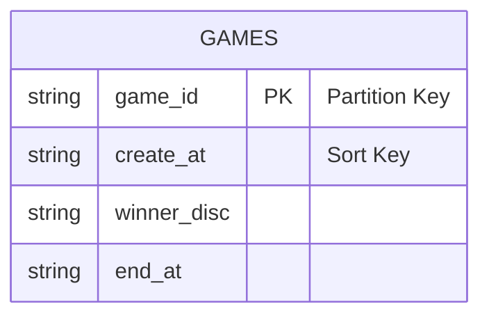
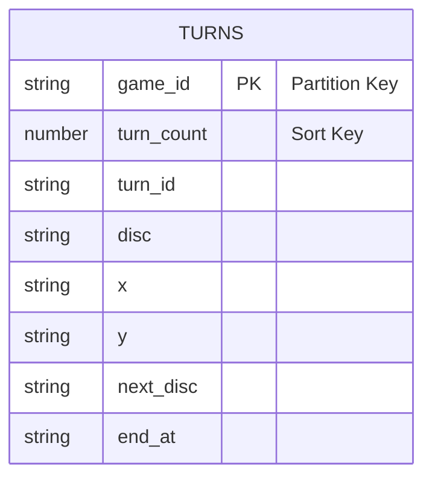
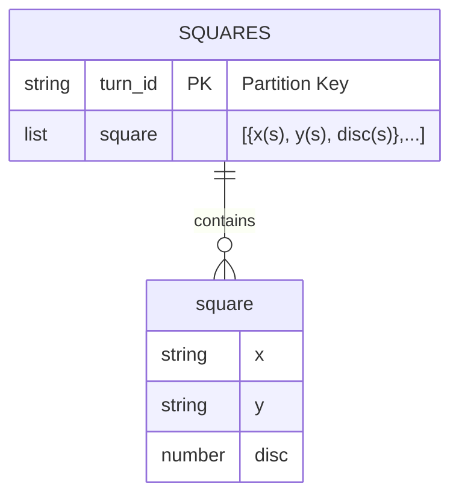

# NoSQL(DynamoDB)

## rsv-game

```mermaid
erDiagram
    GAMES {
      string game_id PK "Partition Key"
      string create_at "Sort Key"
      string winner_disc
      string end_at
    }
```

## rsv-turns

```mermaid
erDiagram
    TURNS {
      string game_id PK "Partition Key"
      number turn_count "Sort Key"
      string turn_id
      string disc
      string x
      string y
      string next_disc
      string end_at
    }
```

## rsv-square

```mermaid
erDiagram
    SQUARES {
      string turn_id PK "Partition Key"
      list square "[{x(s), y(s), disc(s)},...]"
    }
    square {
        string x
        string y
        number disc
    }

    SQUARES ||--o{ square : "contains"
```

## rsv-attributes

key(S,PK), value(S)
